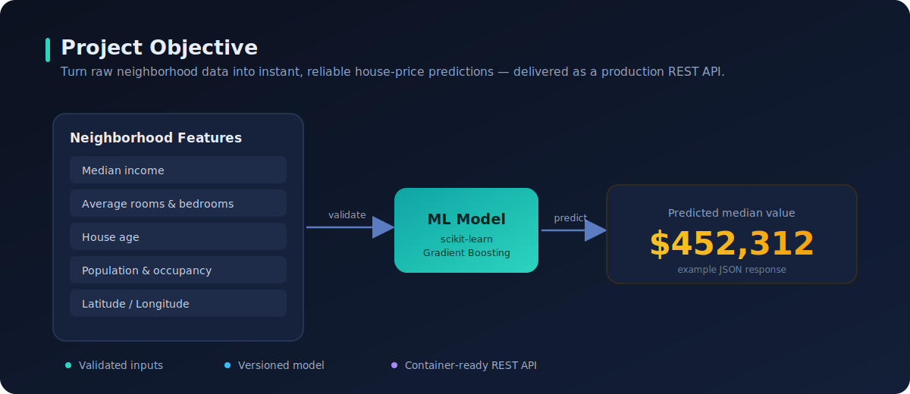
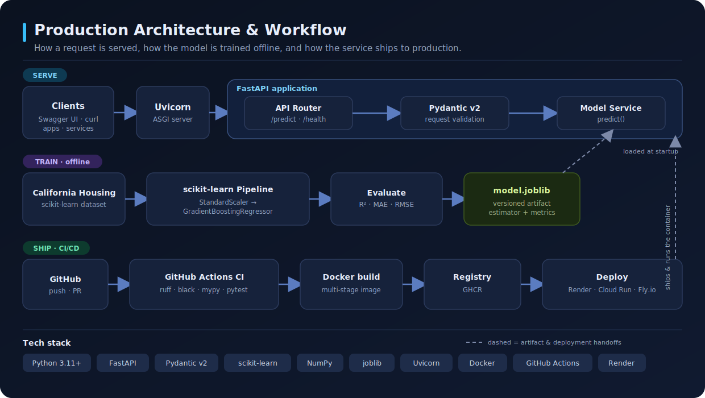
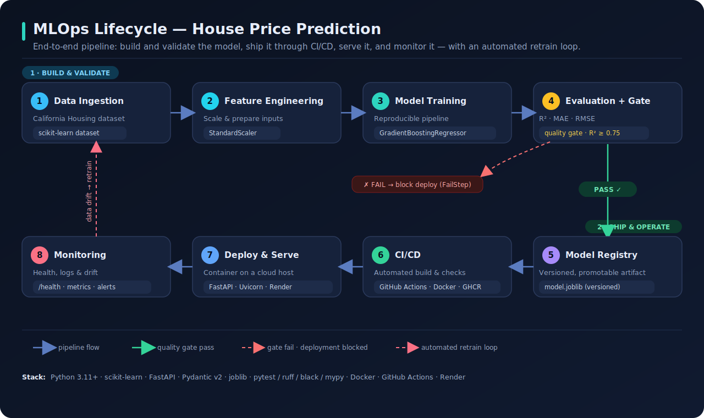

# 🏠 House Price Prediction API

[](https://github.com/omaku-petra/house-price-api/actions/workflows/ci.yml)
[](https://www.python.org/downloads/)
[](https://fastapi.tiangolo.com/)
[](https://github.com/psf/black)
[](https://github.com/astral-sh/ruff)
[](LICENSE)

A small, production-grade REST API that predicts median house prices from
neighborhood features, powered by a scikit-learn model and served with FastAPI.

<p align="center">
  
</p>

---

## 📖 What is this? (explained for anyone to understand)

Imagine a vending machine, but instead of snacks it gives you **house-price
estimates**. You feed it facts about a neighborhood : median income, average
number of rooms, house age, location and it hands back a predicted price.

That "guessing" is **machine learning**. We take a public dataset where both the
neighborhood facts *and* the real house values are known, and train a math model
to learn the pattern that connects them. Once trained, the model is frozen and
saved to a file so it can make instant predictions without re-learning.

This project wraps that model in a **web API** so any app can ask for a
prediction over the internet. The flow is:

```
You send neighborhood features  ──►  the API validates them
                                 ──►  the model predicts a price
                                 ──►  you get the price back as JSON
```

The three ideas to know:

- **Model** — the trained math formula that turns features into a price.
- **API** — a program that waits for requests on a web address and responds.
- **POST request** — sending data *to* a web address (as opposed to just reading
  from it). You POST the house features; the API replies with a price.

> **A note on the data.** The original version of this project used the classic
> *Boston Housing* dataset, which scikit-learn **removed** because one of its
> features encoded a racially biased assumption. This project uses the modern
> **California Housing** dataset instead — same kind of task, no ethical baggage.

---

## ✨ Features

- ⚡ **FastAPI** with automatic, interactive OpenAPI docs at `/docs`.
- ✅ **Typed request/response validation** via Pydantic v2 (bad input → clear `422`).
- 🧠 **Reproducible training pipeline** (`StandardScaler` + `GradientBoostingRegressor`).
- 📦 **Versioned model artifact** bundling the estimator, metrics, and metadata.
- 🩺 **Health endpoint** for liveness/readiness probes.
- 🧪 **Full test suite** (pytest + coverage) exercising the real train → serve path.
- 🎨 **Quality gates**: ruff, black, and mypy (strict) enforced in CI.
- 🐳 **Dockerized** (multi-stage, non-root, self-contained image).
- 🚀 **One-click deploy** config for Render (and any Docker host).

---

## 🏗️ Architecture

The service separates three concerns: **serving** requests in real time, **training** the model offline, and **shipping** to production through CI/CD.

<p align="center">
  
</p>

### 🔁 MLOps lifecycle

Beyond serving a single request, the project is designed as a full **MLOps loop**: build and validate the model, gate it on quality, ship it through CI/CD, serve it, and monitor it — with an automated retrain trigger when data drifts.

<p align="center">
  
</p>

| # | Stage | Concern | Tooling |
|---|-------|---------|---------|
| 1 | Data ingestion | Source the training data | scikit-learn California Housing dataset |
| 2 | Feature engineering | Scale and prepare inputs | `StandardScaler` (in-pipeline) |
| 3 | Model training | Reproducible, versioned training | `GradientBoostingRegressor` pipeline |
| 4 | Evaluation + quality gate | Block low-quality models | R² · MAE · RMSE, gated on **R² ≥ 0.75** |
| 5 | Model registry | Versioned, promotable artifact | `model.joblib` bundle (estimator + metrics) |
| 6 | CI/CD | Automated build and checks | GitHub Actions · ruff/black/mypy/pytest · Docker · GHCR |
| 7 | Deploy & serve | Container serving in production | FastAPI · Uvicorn · Docker · Render |
| 8 | Monitoring | Health, logs, and drift | `/health` probe · structured logging · metrics/alerts |

> The evaluation quality gate mirrors a production `ConditionStep`: models that clear the R² threshold are promoted and deployed; models that fail are blocked. Monitoring closes the loop by flagging drift and triggering a retrain.

## 🗂️ Project structure

```
house-price-api/
├── app/
│   ├── main.py             # App factory + lifespan (loads model on startup)
│   ├── api/
│   │   ├── routes.py       # / , /health , /predict endpoints
│   │   └── dependencies.py # Model dependency injection
│   ├── core/
│   │   ├── config.py       # Env-driven settings (pydantic-settings)
│   │   └── logging.py      # Logging setup
│   ├── schemas/
│   │   └── house.py        # Pydantic request/response models
│   ├── services/
│   │   └── model.py        # Model loading + prediction logic
│   └── ml/
│       └── train.py        # Reproducible training pipeline (CLI)
├── tests/                  # pytest suite (API, schema, model)
├── artifacts/              # Trained model.joblib lives here (git-ignored)
├── scripts/predict_example.py
├── .github/workflows/ci.yml
├── Dockerfile · docker-compose.yml · render.yaml
├── pyproject.toml · Makefile · .pre-commit-config.yaml
└── README.md · LICENSE · CONTRIBUTING.md
```

---

## 🚀 Quickstart

```bash
# 1. Clone and enter the project
git clone https://github.com/omaku-petra/house-price-api.git
cd house-price-api

# 2. Create a virtual environment
python -m venv .venv && source .venv/bin/activate   # Windows: .venv\Scripts\activate

# 3. Install (app + dev tooling)
make install            # or: pip install -e ".[dev]"

# 4. Train the model (creates artifacts/model.joblib)
make train              # or: python -m app.ml.train

# 5. Run the API with hot reload
make run                # or: uvicorn app.main:app --reload
```

Then open **http://localhost:8000/docs** for the interactive Swagger UI.

---

## 🔌 API reference

### `GET /health`
Returns service status and the loaded model version.

```json
{ "status": "ok", "model_version": "1.0.0" }
```

### `POST /predict`
Predicts median house values for one or more California census block groups.

**Request**

```json
{
  "inputs": [
    {
      "MedInc": 8.3252,
      "HouseAge": 41.0,
      "AveRooms": 6.9841,
      "AveBedrms": 1.0238,
      "Population": 322.0,
      "AveOccup": 2.5556,
      "Latitude": 37.88,
      "Longitude": -122.23
    }
  ]
}
```

**Response**

```json
{
  "predictions": [{ "predicted_value_usd": 452312.5 }],
  "model_version": "1.0.0",
  "unit": "USD"
}
```

**Try it with `curl`:**

```bash
curl -X POST http://localhost:8000/predict \
  -H "Content-Type: application/json" \
  -d '{"inputs":[{"MedInc":8.3252,"HouseAge":41,"AveRooms":6.9841,"AveBedrms":1.0238,"Population":322,"AveOccup":2.5556,"Latitude":37.88,"Longitude":-122.23}]}'
```

Or run the bundled example: `python scripts/predict_example.py`.

### Input features

| Field        | Meaning                                            | Constraint        |
|--------------|----------------------------------------------------|-------------------|
| `MedInc`     | Median income in block group (tens of thousands $) | `> 0`             |
| `HouseAge`   | Median house age (years)                           | `0 – 100`         |
| `AveRooms`   | Average rooms per household                        | `> 0`             |
| `AveBedrms`  | Average bedrooms per household                     | `> 0`             |
| `Population` | Block group population                             | `>= 0`            |
| `AveOccup`   | Average household occupancy                         | `> 0`             |
| `Latitude`   | Latitude                                           | `32 – 42`         |
| `Longitude`  | Longitude                                          | `-125 – -113`     |

Unknown or missing fields are rejected with an HTTP `422` and a descriptive error.

---

## 🧪 Testing & quality

```bash
make test        # pytest with coverage
make lint        # ruff
make typecheck   # mypy (strict)
make format      # auto-format with black + ruff --fix
make check       # lint + typecheck + test (everything CI runs)
```

Continuous integration runs all of the above and builds the Docker image on every
push and pull request (see `.github/workflows/ci.yml`).

---

## 🐳 Docker

```bash
docker compose up --build          # builds, trains, and serves on :8000
# or
docker build -t house-price-api .
docker run -p 8000:8000 house-price-api
```

The image is multi-stage and runs as a non-root user. The model is trained during
the build, so the container is fully self-contained.

---

## 🌐 Deployment

`render.yaml` provides a ready-to-use [Render](https://render.com) blueprint
(Docker runtime, `/health` health check). Any platform that runs a Docker
container — Railway, Fly.io, Google Cloud Run, AWS App Runner — works the same way.

---

## 🧠 The model

| | |
|---|---|
| **Dataset** | California Housing (`sklearn.datasets.fetch_california_housing`) |
| **Pipeline** | `StandardScaler` → `GradientBoostingRegressor` |
| **Target** | Median house value (converted to USD in the response) |
| **Metrics** | R², MAE, RMSE reported on a held-out test split at train time |

Retrain anytime with `make train`. Metrics and metadata are embedded in the
artifact and surfaced via the model version.

---

## ⚙️ Configuration

All settings are environment variables (prefixed `APP_`), overridable via a `.env`
file. See `.env.example`.

| Variable          | Default                   | Description                     |
|-------------------|---------------------------|---------------------------------|
| `APP_ENVIRONMENT` | `development`             | Deployment environment label.   |
| `APP_LOG_LEVEL`   | `INFO`                    | Logging level.                  |
| `APP_MODEL_PATH`  | `artifacts/model.joblib`  | Path to the serialized model.   |

---

## 🤝 Contributing

See [CONTRIBUTING.md](CONTRIBUTING.md). In short: `make install`, make your change
with tests, and keep `make check` green.

## 📄 License

[MIT](LICENSE) © Cla-Petra Omaku
